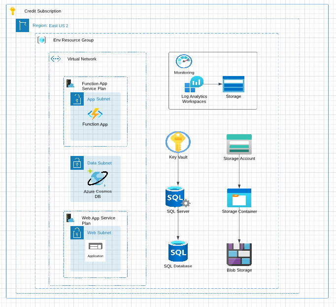

# GRHOADS_ACE_WORKLOAD
Repository for ACE capstone workload deployment

## Requirements

| Name | Version |
|------|---------|
|  [terraform](#requirement\_terraform) | >= 1.1.0 |
|  [azurerm](#requirement\_azurerm) | ~> 3.20.0 |

## Providers

| Name | Version |
|------|---------|
|  [archive](#provider\_archive) | 2.2.0 |
|  [azurerm](#provider\_azurerm) | 3.0.2 |

## Modules

No modules.

## Resources

| Name | Type |
|------|------|
| [azurerm_app_service_virtual_network_swift_connection.swift_appservice](https://registry.terraform.io/providers/hashicorp/azurerm/latest/docs/resources/app_service_virtual_network_swift_connection) | resource |
| [azurerm_app_service_virtual_network_swift_connection.swift_function](https://registry.terraform.io/providers/hashicorp/azurerm/latest/docs/resources/app_service_virtual_network_swift_connection) | resource |
| [azurerm_cosmosdb_account.cosmosdb1](https://registry.terraform.io/providers/hashicorp/azurerm/latest/docs/resources/cosmosdb_account) | resource |
| [azurerm_function_app.azure_functionapp1](https://registry.terraform.io/providers/hashicorp/azurerm/latest/docs/resources/function_app) | resource |
| [azurerm_key_vault_secret.keyvault_pass_secret](https://registry.terraform.io/providers/hashicorp/azurerm/latest/docs/resources/key_vault_secret) | resource |
| [azurerm_key_vault_secret.keyvault_user_secret](https://registry.terraform.io/providers/hashicorp/azurerm/latest/docs/resources/key_vault_secret) | resource |
| [azurerm_linux_web_app.web_app1](https://registry.terraform.io/providers/hashicorp/azurerm/latest/docs/resources/linux_web_app) | resource |
| [azurerm_log_analytics_workspace.log_space1](https://registry.terraform.io/providers/hashicorp/azurerm/latest/docs/resources/log_analytics_workspace) | resource |
| [azurerm_mssql_database.mssql_database1](https://registry.terraform.io/providers/hashicorp/azurerm/latest/docs/resources/mssql_database) | resource |
| [azurerm_mssql_server.mssql_server1](https://registry.terraform.io/providers/hashicorp/azurerm/latest/docs/resources/mssql_server) | resource |
| [azurerm_service_plan.functionapp_serviceplan](https://registry.terraform.io/providers/hashicorp/azurerm/latest/docs/resources/service_plan) | resource |
| [azurerm_service_plan.webapp_serviceplan](https://registry.terraform.io/providers/hashicorp/azurerm/latest/docs/resources/service_plan) | resource |
| [archive_file.hello_world](https://registry.terraform.io/providers/hashicorp/archive/latest/docs/data-sources/file) | data source |
| [azurerm_key_vault.keyvault1](https://registry.terraform.io/providers/hashicorp/azurerm/latest/docs/data-sources/key_vault) | data source |
| [azurerm_resource_group.environment_rg](https://registry.terraform.io/providers/hashicorp/azurerm/latest/docs/data-sources/resource_group) | data source |
| [azurerm_storage_account.storage_account1](https://registry.terraform.io/providers/hashicorp/azurerm/latest/docs/data-sources/storage_account) | data source |
| [azurerm_subnet.app-subnet](https://registry.terraform.io/providers/hashicorp/azurerm/latest/docs/data-sources/subnet) | data source |
| [azurerm_subnet.data-subnet](https://registry.terraform.io/providers/hashicorp/azurerm/latest/docs/data-sources/subnet) | data source |
| [azurerm_subnet.web-subnet](https://registry.terraform.io/providers/hashicorp/azurerm/latest/docs/data-sources/subnet) | data source |
| [azurerm_virtual_network.vnet1](https://registry.terraform.io/providers/hashicorp/azurerm/latest/docs/data-sources/virtual_network) | data source |

## Inputs

| Name | Description | Type | Default | Required |
|------|-------------|------|---------|:--------:|
|  [cosmosdb-name](#input\_cosmosdb-name) | name for cosmosDB account | `string` | `"grhoads-cosmosdb"` | no |
|  [env](#input\_env) | environment declaration | `map(string)` | <pre>{   "dev": "dev",   "prod": "prod",   "test": "test" }</pre> | no |
|  [function\_app\_name](#input\_function\_app\_name) | name for function app | `string` | `"grhoads-function-app"` | no |
|  [functionapp\_service\_plan\_name](#input\_functionapp\_service\_plan\_name) | name for app service plan for workload | `string` | `"functionapp-plan"` | no |
|  [log\_space\_name](#input\_log\_space\_name) | name for log analytics workspace | `string` | `"log-space"` | no |
|  [sql\_database\_name](#input\_sql\_database\_name) | name for sql database | `string` | `"grhoads-sqldatabase"` | no |
|  [sql\_server\_name](#input\_sql\_server\_name) | name for sql database | `string` | `"grhoads-sqlserver"` | no |
|  [web\_app\_name](#input\_web\_app\_name) | name for main web app | `string` | `"grhoads-web-app"` | no |
|  [webapp\_service\_plan\_name](#input\_webapp\_service\_plan\_name) | name for app service plan for workload | `string` | `"webapp-plan"` | no |

## Outputs

No outputs.